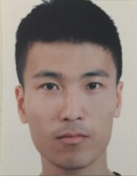

# Fei Yin

## Education

* 2021, Master of Science, Mechanical Engineering, TU Braunschweig 
    Study work with development of a medication delivery process in the customised medication (2.0 in germany grading system) (keywords: ROS, Path Planning, Socket communication)  
    Master thesis with Investigating the effectiveness of synthetic data for Vision-based autonomous landing systems )1.3 in germany grading system) (keywords: sim2real, semantic segmentation, Tying simulator, domain randomization, domain adaptation, image enhancement)

* 2018, Bachelor of Engineering, Mechanical Engineering, Ostfalia University of Applied Sciences  
    Two study works with construction of a VHF-GPS based mobile collision warning system (1.0 in germany grading system) (keywords: UART, Microcontroller, C language) & realisation of an IoT application for the Industry 4.0 and replacing a Siemens CPA for OPC UA (1.0 in germany grading system) (keywords: IoT Cloud, IoT Gateway, MQTT, HTTP, HTML, CSS, Javascript)  
    Bachelor thesis with development of an app to control the mini-factory (1.7 in germany grading system) (keywords: Android Application , Mit App Inventor, HTTP)

## Work experience

* 04/2020 - 06/2021, Student Assistant, Institute of flight guidance at Technical University Braunschweig
    Proposed strateries about mission planning for UAV inspection of rails at hamburg harbor by using simulation in research project 'AeroInspekt' and implemented an data-helper-tool to detect completeness of flight data and copy data.

* 04/2020 - 06/2020, Student Assistant, Institute of automotive engineering at Technical University Braunschweig
    Realisation of a communication modul between ROS and Android application in project 'SynCoPark' with socket

* 07/2017 - 11/2017, Control engineering laboratory at Ostfalia University of Applied Sciences
    Supervision of the mini-factory in the Control Engineering Laboratory

## Skills

* Programming language: C++, python, a little of java

* Software: Matlab/Simulink, MS Office, CAD

* Others: pytorch, opencv, git, gazebo, ROS

## Language

* Germany

* English

* Chinese (mother language)